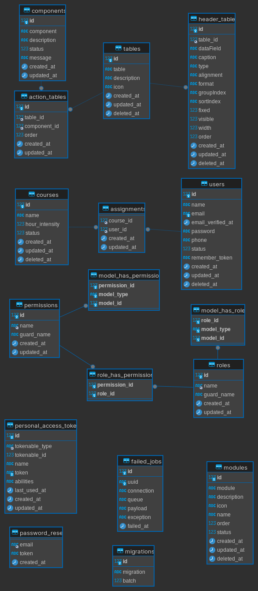
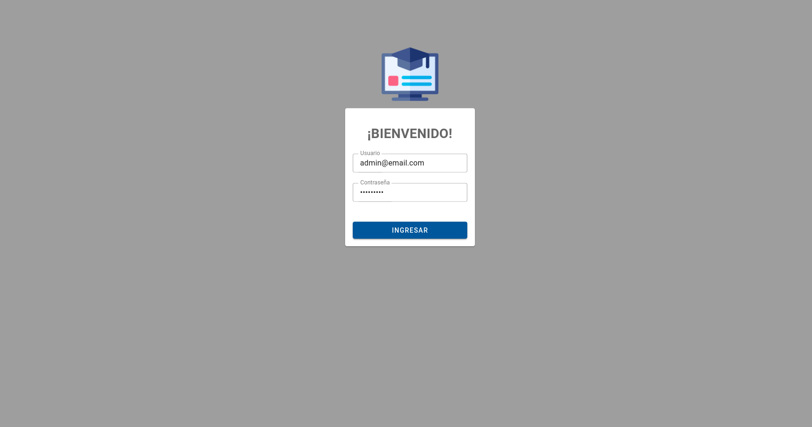
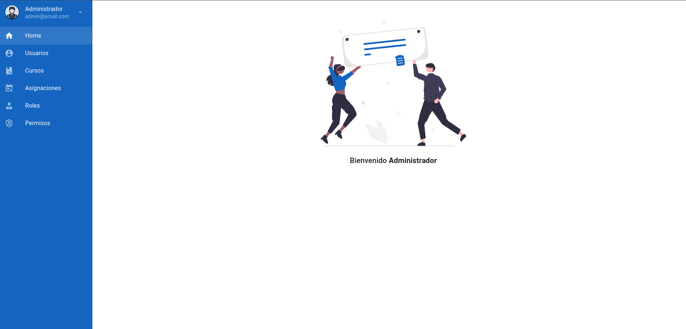
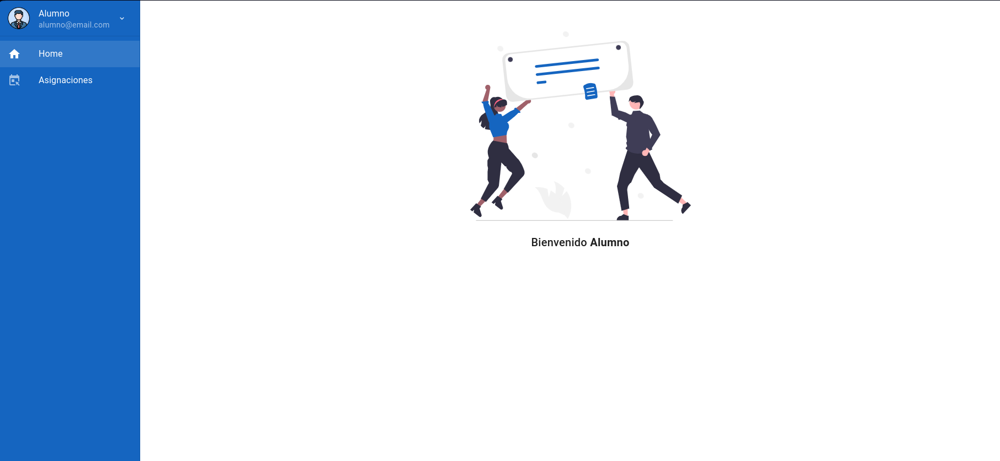

# 1. API DOCUMENTACIÓN

Teniendo en cuenta la problematica presentada se presenta la siguiente solución.

La idea inicial es la creación de un sistema web tipo _REST_ que permita llevar por separado el entorno _backend_ del _frontend_, de esta forma, se implementa los servicios usando _php Laravel_ y _Vue js_ del lado del cliente. 

Ya inmersos en la problematica, se lleva a cabo un sistema que maneja roles y permisos, los cuales permiten llevar un poco más allá el problema, debido a que, inicialmente son dos usuarios pero si se piensa en un futuro podrían ser _N perfiles_ y con diferentes permisos. Así, continuamos con la explicación de la solución.

## 1.1 Diagrama Entidad relación



Iniciamos con las primeras 4 tablas de este diagrama, `components`, `action_tables`, `tables` y `header_tables`

Esta pequeña arquitectura se implementa para poder llevar un control de los registros que se muestran en las tablas (Grid) de cada modulo, con el fin que si a futuro se desean agregar o quitar más campos se pueda realizar por base de datos, de la misma forma con las acciones de esta. Realizando dentro de los servicios una función generica que permita hacer esto.

Aquí el centro corresponde a  _tables_ donde se crean los registros para las tablas del sistema.


Luego continuamos con las tablas principales de nuestro objetivo y son _courses_, _assignment_ y _users_ que corresponden a los cursos, usuarios y asignaciones.

Ya por último tenemos las tablas asociadas a laravel (por defecto) y las tablas relacionadas al paquete de [Spattie Laravel](https://spatie.be/docs/laravel-permission/v6/basic-usage/basic-usage) 


## 1.2 Endpoints

Se asocia postman 

## 1.3
### Pasos para iniciar project
- Realiza una copia al archivo `.env.example` y lo llamas `.env` 
- Asegurate de tener creada tu base de datos para que la asocies dentro de la variable _DB_DATABASE_ de igual forma, asegurate de que las credenciales estén correctas.
- Asegurate de haber descargado las dependencias del projecto, si no lo haz hecho ejecuta el siguiente comando 
```bash
composer install
```
- Crea una _key_ para el proyecto

```bash
php artisan key:generate
```

- Ya teniendo todo configurado ejecutamos las migraciones del proyecto con sus respectivos seeders, estos nos permiten cargar información directo a la base de datos, para ello ejecutaremos

```bash
php artisan migrate --seed
```

si ya hiciste este proceso pero por alguna razon olvidaste el seed ejecutas
```bash
php artisan migrate:fresh --seed
```
ten en cuenta que esto hace un `rollback` a toda la base de datos e iniciará de nuevo.

- Por ultimo ejecuta el siguiente comando para iniciar el servidor
```bash
php artisan serve
```

## 1.4 Capturas
### Login


### Home Admin


### Home alumno

